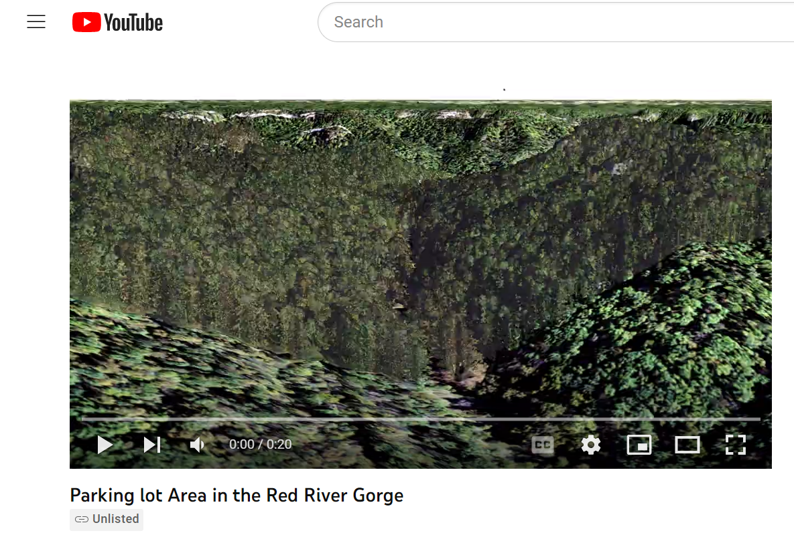

# Lab-05-Visualizing-lidar-data
A 3D map of the parking lot area in the Red River Gorge with a 20 sec video of the same area

   
This map show a 3D view of the interest area – [Download geospatial PDF](parking-lot.pdf)

   
A 20 sec video of the interest area – [Watch the video in YouTube](https://youtu.be/wKDgyfYiXN8)

Map and video created by Maysam Alazri for GEO409, Spring 2023, University of Kentucky Department of Geography
